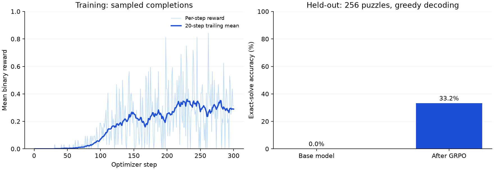

# Countdown GRPO

Direct reinforcement learning on [`Qwen/Qwen3.5-0.8B-Base`](https://huggingface.co/Qwen/Qwen3.5-0.8B-Base)
using [`Jiayi-Pan/Countdown-Tasks-3to4`](https://huggingface.co/datasets/Jiayi-Pan/Countdown-Tasks-3to4).
No supervised fine-tuning stage. Designed for one NVIDIA GPU with 16 GB VRAM,
using BF16 LoRA and Hugging Face TRL's GRPO trainer.

## Results

One 300-step run improved greedy exact-solve accuracy from **0/256 to 85/256
(33.2%)** on the same held-out Countdown puzzles, with no SFT or formatting bonus.
Training took **85.6 minutes** on an **RTX 4090 Laptop GPU (16 GB VRAM)**.

| Held-out metric | Base model | After GRPO |
| --- | ---: | ---: |
| Exact solutions | 0 / 256 (0.0%) | **85 / 256 (33.2%)** |
| Valid expressions using all input numbers | 11 / 256 (4.3%) | **90 / 256 (35.2%)** |



Training used seed 42, BF16 LoRA rank 16, eight sampled answers per puzzle,
32 completions per optimizer step, and a 256-token completion limit. Both
evaluations used greedy decoding with that same limit. The first positive
training reward appeared at step 31. Peak **PyTorch-allocated** GPU memory was
2.72 GiB; this excludes reserved memory and other GPU allocations.

### Logs, artifacts, and reproducibility

- **[W&B training run and learning curves](https://wandb.ai/mohamedsobhi777/countdown-grpo/runs/uv3hjjih)**
- [Baseline evaluation and completions](https://wandb.ai/mohamedsobhi777/countdown-grpo/runs/qu1ovu2z)
- [Final evaluation and completions](https://wandb.ai/mohamedsobhi777/countdown-grpo/runs/1qrixzrf)
- [Final LoRA adapter artifact](https://wandb.ai/mohamedsobhi777/countdown-grpo/artifacts/model/uv3hjjih-adapter/v0)
- [Training artifacts: source snapshot, puzzle splits, checkpoints, and results](https://wandb.ai/mohamedsobhi777/countdown-grpo/runs/uv3hjjih/artifacts)
- [Complete W&B workspace](https://wandb.ai/mohamedsobhi777/countdown-grpo/workspace)
- [Experiment report and raw results in this repository](results/2026-09-14/README.md)
- [Exact training-code commit](https://github.com/mohamedsobhi777/countdown-grpo/tree/0a432a272591f7683b711a9c867c01e7d939fca1)

The raw evaluation reports and per-step metrics are also committed here so the
results can be inspected without W&B access. Model weights remain in W&B artifacts.
The experiment used a clean working tree and pinned model/dataset revisions;
configuration and package versions are recorded in the run.

### Example from the held-out set

Numbers: `[67, 54, 98, 19]`; target: `66`. These are the actual model outputs:

**Before:**

```text
(67 - 54) * (98 / 19) = 66
```

**After:**

```text
(98 - 67) = 31
31 + 54 = 85
85 - 19 = 66

<answer>(98-67)+54-19</answer>
```

The baseline expression is mathematically incorrect and lacks the required answer
block. The trained model's expression evaluates exactly to 66 and uses every input
number once. This example is selected to illustrate a success; the aggregate
score above includes all 256 puzzles, and the raw reports include failures.

### Limitations

This is one seed on 256 held-out puzzles, not evidence of general reasoning
improvement. Exact-solve scoring requires the specified answer format, so the
improvement reflects both formatting and arithmetic task performance. The split
excludes duplicate/permuted puzzles from training, but cannot rule out exposure
during the base model's pretraining. About **59.9% of completions in the final 30
training steps** hit the 256-token cap. A longer-output evaluation and additional
training seeds are useful next experiments; neither has been run for this report.

CPU unit tests cover reward verification, data splits, and configuration. The
archived reports have also been re-scored with the verifier, checked for identical
evaluation puzzles, and checked for overlap with the selected training puzzles.

## Setup

Python 3.12 and [uv](https://docs.astral.sh/uv/) are required. Install a CUDA-enabled
PyTorch build compatible with your NVIDIA driver when configuring the environment.
The training extra pins PyTorch 2.8.0 from PyPI (CUDA 12.8 on Linux x86-64);
check CUDA availability before
downloading the model:

```bash
uv sync --locked --extra train
uv run --extra train python -c 'import torch; print(torch.__version__, torch.version.cuda, torch.cuda.is_available(), torch.cuda.is_bf16_supported())'
```

The checkpoint is approximately 1.77 GB. Dependencies and CUDA libraries require
additional disk space. Model and dataset downloads occur only when invoking `train`
or `evaluate`; the usual Hugging Face cache is used.

Inspect settings and run CPU tests without the training dependencies or downloads:

```bash
uv run countdown-grpo config
PYTHONPATH=src python3 -m unittest discover -s tests -v
```

## Run the experiment

Run the complete baseline → 300-step training → final evaluation sequence with
W&B logging (requires a local `wandb login`):

```bash
uv run --locked --extra train python -u scripts/run_experiment.py
```

Each stage has its own run in one W&B group under `mohamedsobhi777/countdown-grpo`.
Source code, Git commit, package versions, config, system metrics, reward/loss
curves, generated completions, exact puzzle splits, checkpoint artifacts, final
adapter, and evaluation JSON/Tables are logged. Outputs stay in a unique local
`outputs/<group>/` directory. The sequence stops on a failed stage and records
its status in `status.json`; it never silently restarts training.

Individual `train` and `evaluate` commands accept `--wandb`, `--group`, and
`--run-name`. Without `--wandb`, they log locally. A resumed checkpoint starts a
new W&B run; use the same group to associate attempts. Model artifacts contain
LoRA weights; the pinned base checkpoint is still needed to load them.

Measure the pretrained model on a fixed held-out set:

```bash
uv run --extra train countdown-grpo evaluate --result outputs/baseline.json
```

Start a separate ten-step trial to check memory and approximate throughput:

```bash
uv run --extra train countdown-grpo train --steps 10 --output-dir outputs/trial
```

Then start the default 300-step experiment from the base checkpoint:

```bash
uv run --extra train countdown-grpo train
```

Each optimizer step consumes 32 completions: four puzzles with eight sampled
answers each. These are optimizer steps, not epochs over the whole dataset.
Defaults select up to 20,000 unique training puzzles, cap completions at 256 tokens,
and use LoRA rank 16 across language-model linear layers. The vision tower is
excluded when loading the checkpoint. GRPO is explicitly selected with `loss_type="grpo"`;
the KL coefficient is zero, so no reference model is held in memory.

Resume an interrupted default run from an actual saved checkpoint (replace 50
with the checkpoint number present on disk):

```bash
uv run --extra train countdown-grpo train --resume outputs/countdown/checkpoint-50
```

Resume requires the original config and output directory. Two recent checkpoints
are retained; the final adapter is saved separately to `outputs/countdown/adapter`.
Starting a new run in a nonempty output directory is refused.

Evaluate the adapter on the same puzzles with the same greedy decoding:

```bash
uv run --extra train countdown-grpo evaluate \
  --adapter outputs/countdown/adapter --result outputs/after.json
```

Compare `solve_rate` and `valid_rate` in the two reports and inspect their saved
completions. This measures greedy exact-solve accuracy, not pass@8. Keep the same
config, seed, dataset revision, and completion limit for a meaningful comparison.
The report refuses to overwrite an existing file. The standalone `train` command
does not run evaluation; `scripts/run_experiment.py` runs both evaluations automatically.

## Reward and split

The prompt permits scratch work and requires exactly one final
`<answer>expression</answer>` block. For example, with `[44, 19, 35]` and target 98:

```text
<answer>(44 + 19) + 35</answer>
```

The verifier accepts only positive integer literals, binary `+ - * /`, and
parentheses; each input number must appear exactly once, respecting duplicates.
Fractional and negative intermediate results are permitted. It uses bounded AST
interpretation and exact rational arithmetic, never `eval`. Target copying,
extra numbers, multiple answer blocks, division by zero, powers, and code are rejected.

Default reward is 1 for a correct valid expression and 0 otherwise. Optional
`format_reward` in `[0, 0.1]` rewards valid but incorrect expressions. This changes
the objective and is disabled by default. With binary rewards, groups with no
reward variation provide no relative correctness signal; inspect reward variation
if training stalls. Higher solve rate is evidence of task improvement, not proof
that general reasoning has emerged.

Puzzles are deduplicated by `(target, sorted numbers)`. A seeded SHA-256 partition
assigns each canonical puzzle to train or evaluation before sampling. Duplicates
and number permutations cannot leak across the split. Evaluation defaults to 256
puzzles from the 2% holdout partition.

## Outputs and tuning

- `config.json`: effective experiment settings and pinned Hub revisions.
- `holdout.json`: selected evaluation puzzles.
- `metrics.jsonl`: TRL reward/length metrics, elapsed time, average seconds per
  optimizer step, approximate remaining time, and peak allocated GPU memory.
- `checkpoint-*`: resumable training state; `adapter/`: final LoRA adapter.
- Evaluation reports: config, solve rate, validity rate, and every completion.

Edit `configs/local.toml` or pass `--config path.toml`. If memory runs out, first
reduce `max_completion_length` to 128 or `gradient_accumulation_steps` to 16 or 8;
the effective completion batch must remain divisible by `num_generations`.
Gradient accumulation also determines the rollout batch size in this configuration.
Shorter completions can truncate useful answers and change the experiment.

Qwen3.5 uses hybrid linear attention. Optional `causal-conv1d` and Flash Linear
Attention kernels can improve performance; without them Transformers uses its
PyTorch fallback. They require their own CUDA/build compatibility checks and are
not required by this minimal setup. vLLM is deliberately left out of the initial
implementation. Consult the [Qwen3.5 documentation](https://huggingface.co/docs/transformers/model_doc/qwen3_5)
and [TRL GRPO documentation](https://huggingface.co/docs/trl/grpo_trainer).

W&B uploads are enabled only by `--wandb` or the complete experiment script.
No Hugging Face Hub upload is enabled. Weights, outputs, W&B local state, and
environment files are excluded from Git.
